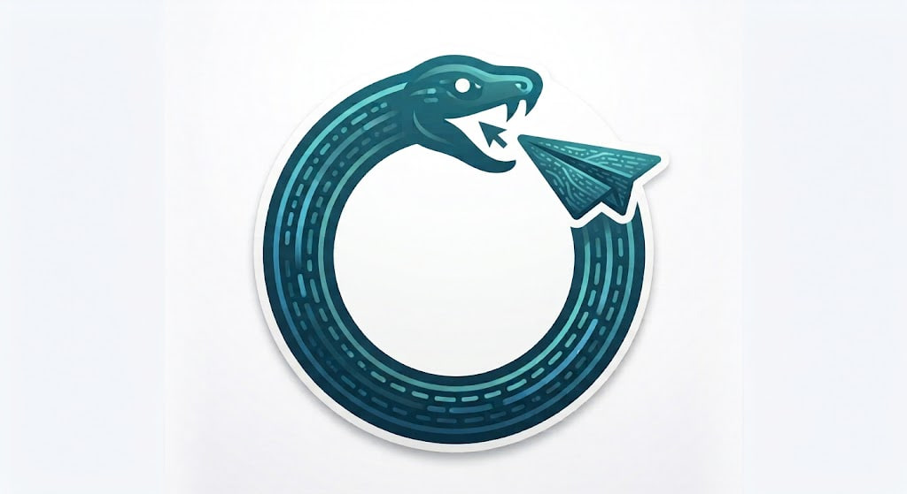

<p align="center">
  
</p>

# Teleboros

> [!WARNING]
> This documentation is currently a work in progress. Some sections may be incomplete or subject to change.

> A self-hosted, statically-generated microblog that mirrors your Telegram channel into a fast, searchable, and beautifully designed website built with Next.js, React, shadcn/ui, and Tailwind CSS.

[](https://vercel.com/new/clone?repository-url=https%3A%2F%2Fgithub.com%2Fandatoshiki%2Fteleboros&env=ADMIN_TOKEN,TELEGRAM_BOT_TOKEN,TELEGRAM_CHAT_ID,GEMINI_API_KEY,DEPLOY_HOOK_URL,BLOB_READ_WRITE_TOKEN,R2_ACCOUNT_ID,R2_ACCESS_KEY_ID,R2_SECRET_ACCESS_KEY,R2_BUCKET_NAME,R2_PUBLIC_DOMAIN&envDescription=Configure%20your%20Telegram%20bot%2C%20security%2C%20and%20storage%20adapters&project-name=teleboros)

[አማርኛ](./readme-am.md)

## 1: Why this exists

This is a complete wheel rebuild of [BroadcastChannel](https://github.com/miantiao-me/BroadcastChannel) created by [@miantiao-me](https://github.com/miantiao-me). The original works perfectly well, but I didn't like the UI, it's SSR on Astro (a framework I wasn't familiar with), and I'm a loyal SSG fanboy — static sites are easier to host anywhere, not just Cloudflare Pages or Vercel. So I rebuilt it from scratch in Next.js with DPlayer video playback, a Telegram-native image grid layout, Lunr.js full-text search, a Gemini-powered **AI semantic search**, and a Twitter-like responsive feed timeline.

**Is it necessary though**? **Absolutely not**, but it's a fun rebuild to adhere with my personal aesthetic visual preference and also a way for me to learn Next.js v16.x.

## 2: Quick start

### 2.1: 1-Click Deploy with Vercel

Click the **Deploy with Vercel** button above to fork the repository and deploy your instance instantly. Pre-configured environment prompts will walk you through your bot tokens and storage configuration.

### 2.2: Local Development

#### Requirements
1. Node.js `>=22`
2. pnpm `>=10`

#### Install and run
```bash
cp .env.example .env
pnpm install
pnpm dev
```

The development server starts on port `4321`.

### 2.3: Self-Hosting with Docker & Docker Compose

Teleboros provides a production-ready, multi-stage Docker build for self-hosters and VPS deployments:

```bash
# 1. Clone repository and create environment file
cp .env.example .env

# 2. Launch with Docker Compose
docker compose up -d --build
```

Persistent data (articles, posts, newsletter subscribers) is automatically mounted to `./data`, and uploaded media is stored in `./public/uploads`.

### 2.4: Build for production manually

```bash
pnpm build
pnpm start
```

The build command runs `pnpm sync --og-image --favicon` automatically before `next build`, so all generated artifacts are created in a single step.

## 3: Configuration

All configuration lives in a single file: `src/lib/constant.ts`. Fork the repo, edit this file, deploy. The only exception is the opt-in **AI semantic search** feature, which additionally needs a `GEMINI_API_KEY` environment variable (see [3.9](#39-ai-semantic-search)).

### 3.1: Channel and site identity

| Key            | Type     | Description                                                                                                          |
| -------------- | -------- | -------------------------------------------------------------------------------------------------------------------- |
| `channel`      | `string` | Telegram channel username without `@`. This is the channel whose content is mirrored.                                |
| `siteUrl`      | `string` | Canonical base URL of the published site (e.g. `https://tg.example.com`). Used for SEO, RSS, and sitemap generation. |
| `telegramHost` | `string` | Telegram web host for fetching channel HTML. Default is `t.me`.                                                      |
| `locale`       | `string` | Default locale. Supported values: `en`, `ja`, `am`.                                                                  |
| `timezone`     | `string` | IANA timezone for date formatting (e.g. `UTC`, `America/New_York`, `Asia/Tokyo`).                                    |

```ts
channel: 'your_channel',
siteUrl: 'https://tg.example.com',
telegramHost: 't.me',
locale: 'en',
timezone: 'UTC',
```

### 3.2: Social links

| Key        | Type     | Description                                                      |
| ---------- | -------- | ---------------------------------------------------------------- |
| `website`  | `string` | Author or organization website URL.                              |
| `twitter`  | `string` | Twitter/X username only, no URL prefix.                          |
| `github`   | `string` | GitHub username only.                                            |
| `telegram` | `string` | Telegram username for the sidebar link.                          |
| `mastodon` | `string` | Mastodon handle without protocol (e.g. `mastodon.social/@user`). |
| `bluesky`  | `string` | Bluesky handle (e.g. `user.bsky.social`).                        |

Leave any field as an empty string to hide it from the sidebar.

```ts
website: 'https://example.com',
twitter: 'username',
github: 'username',
telegram: 'username',
mastodon: 'mastodon.social/@username',
bluesky: 'username.bsky.social',
```

### 3.3: Display options

| Key                | Type       | Description                                                                              |
| ------------------ | ---------- | ---------------------------------------------------------------------------------------- |
| `hideDescription`  | `boolean`  | When `true`, the channel description block below the header is hidden.                   |
| `reactionsEnabled` | `boolean`  | When `true`, Telegram-style emoji reactions are shown on posts.                          |
| `pinnedPostIds`    | `string[]` | Array of Telegram message IDs to pin at the top of the feed (e.g. `['120']`).             |
| `pwa`              | `boolean`  | When `true`, enables service worker registration, web app manifest, and offline caching. |
| `customBanner`     | `string`   | Inline markdown rendered as a banner above the main content. Leave empty to disable.     |
| `customFooter`     | `string`   | Inline markdown that replaces the default footer. Leave empty for the default.           |
| `rssBeautify`      | `boolean`  | When `true`, RSS XML output includes XSLT styling for browser readability.               |

```ts
hideDescription: false,
reactionsEnabled: true,
pinnedPostIds: [],
pwa: true,
customBanner: '**Welcome!** [Source on GitHub](https://github.com/you/repo)',
customFooter: '',
rssBeautify: true,
```

### 3.4: Cloudflare image transforms

| Key                          | Type      | Description                                                                           |
| ---------------------------- | --------- | ------------------------------------------------------------------------------------- |
| `cloudFlare.transform`       | `boolean` | Enable Cloudflare image transform delivery for mirrored images under `/media/*`.      |
| `cloudFlare.transformPrefix` | `string`  | URL prefix for Cloudflare transforms (e.g. `/cdn-cgi/image/format=auto,quality=85/`). |

This is completely optional. When `cloudFlare.transform` is `true`, the build-time sync rewrites static media paths from their default `/media/…` form to the prefixed version (`/cdn-cgi/image/format=auto,quality=85/media/…`). The rewrite happens at build time only — there is no runtime path conversion. If you are not deploying behind Cloudflare, leave this set to `false` and media paths will stay as plain `/media/*` URLs.

```ts
cloudFlare: {
  transform: false,
  transformPrefix: '/cdn-cgi/image/format=auto,quality=85/',
},
```

### 3.5: Static proxy

| Key           | Type     | Description                                                                                       |
| ------------- | -------- | ------------------------------------------------------------------------------------------------- |
| `staticProxy` | `string` | Proxy base URL for Telegram-origin media at runtime. Leave empty unless you need a runtime proxy. |

Most deployments should leave this empty since media is mirrored locally at build time.

### 3.6: SEO

| Key               | Type       | Description                                                                             |
| ----------------- | ---------- | --------------------------------------------------------------------------------------- |
| `seo.title`       | `string`   | Site title for browser tabs and search results.                                         |
| `seo.description` | `string`   | Meta description for search engines and social previews.                                |
| `seo.ogImage`     | `string`   | Open Graph image path (e.g. `/og-auto.png`). Generated automatically with `--og-image`. |
| `seo.keywords`    | `string[]` | Array of SEO keywords for meta tags.                                                    |
| `seo.author`      | `string`   | Author name for meta tags and structured data.                                          |
| `seo.noIndex`     | `boolean`  | When `true`, emits `noindex` in robots meta.                                            |
| `seo.noFollow`    | `boolean`  | When `true`, emits `nofollow` in robots meta.                                           |

```ts
seo: {
  title: 'My Teleboros',
  description: 'Posts from my Telegram channel.',
  ogImage: '/og-auto.png',
  keywords: ['telegram', 'microblog', 'my-channel'],
  author: 'Your Name',
  noIndex: false,
  noFollow: false,
},
```

### 3.7: Analytics

| Key                           | Type     | Description                                                                      |
| ----------------------------- | -------- | -------------------------------------------------------------------------------- |
| `analytics.googleAnalyticsId` | `string` | Google Analytics 4 measurement ID (e.g. `G-XXXXXXXXXX`). Leave empty to disable. |
| `analytics.umamiScriptUrl`    | `string` | Self-hosted Umami analytics script URL. Leave empty to disable.                  |
| `analytics.umamiWebsiteId`    | `string` | Umami website ID for this site.                                                  |

```ts
analytics: {
  googleAnalyticsId: '',
  umamiScriptUrl: '',
  umamiWebsiteId: '',
},
```

### 3.8: Build and sync limits

| Key                     | Type     | Description                                                                                                 |
| ----------------------- | -------- | ----------------------------------------------------------------------------------------------------------- |
| `maxPages`              | `number` | Maximum Telegram snapshot pages to fetch during sync. Each page contains roughly 20 posts. Default is `50`. |
| `mediaMirror.directory` | `string` | Public URL prefix for mirrored media files (e.g. `/media`).                                                 |
| `mediaMirror.userAgent` | `string` | User-Agent string used when downloading media from Telegram.                                                |

```ts
maxPages: 50,
mediaMirror: {
  directory: '/media',
  userAgent: 'TeleborosStaticSync/1.0',
},
```

### 3.9: AI semantic search

| Key                           | Type     | Description                                                                                          |
| ----------------------------- | -------- | ---------------------------------------------------------------------------------------------------- |
| `semanticSearch.enabled`      | `boolean`| Enables the "AI" tab on the `/search` page and generates embeddings during sync. Default is `true`.  |
| `semanticSearch.model`        | `string` | Gemini embedding model used for retrieval. Default is `gemini-embedding-001`.                        |
| `semanticSearch.outputDimensionality` | `number` | Vector dimensionality for embeddings. Default is `768` (recommended: 768, 1536, or 3072).      |
| `semanticSearch.maxResults`   | `number` | Maximum number of results returned by the semantic search API. Default is `25`.                      |
| `semanticSearch.inputTokenLimit` | `number` | Maximum characters embedded per post. Default is `1800`.                                          |

```ts
semanticSearch: {
  enabled: true,
  model: 'gemini-embedding-001',
  outputDimensionality: 768,
  maxResults: 25,
  inputTokenLimit: 1800,
},
```

This feature lets visitors search posts by asking questions in plain language ("what did I write about deploying Go services?") instead of typing exact keywords. It works in three parts:

1. **Build time** — `pnpm sync` embeds every post once via the Gemini [batch embed API](https://ai.google.dev/gemini-api/docs/embeddings) and saves the vectors to `public/search/embeddings.json`.
2. **Runtime** — `POST /api/semantic-search` embeds the user's question and ranks posts by cosine similarity, returning the top matches with a similarity score and a snippet window.
3. **Frontend** — the `/search` page gains a Keyword / AI tab switcher; the AI tab renders a natural-language question input and the ranked results.

Requirements:

- A `GEMINI_API_KEY` (Google AI Studio) available **both at build time and runtime** (e.g. as an environment variable in Vercel, or a `.env` file for local sync).
- A serverless runtime for the API route. Like `/api/compose` and `/api/webhook`, this is **incompatible with a pure static export** (`NEXT_OUTPUT_MODE=export`).
- The Gemini API is a paid/rate-limited service — each sync makes one batched embed request, and each search query makes one embed request. Set `enabled: false` to disable the feature entirely (embeddings are skipped and the AI tab is hidden).

### 3.10: Full example

```ts
export const SITE_CONSTANTS: SiteConstantConfig = {
  channel: 'your_channel',
  locale: 'en',
  timezone: 'UTC',
  siteUrl: 'https://tg.example.com',
  telegramHost: 't.me',
  staticProxy: '',
  cloudFlare: {
    transform: false,
    transformPrefix: '/cdn-cgi/image/format=auto,quality=85/',
  },
  hideDescription: false,
  reactionsEnabled: true,
  pwa: true,
  website: 'https://example.com',
  twitter: 'username',
  github: 'username',
  telegram: 'your_channel',
  mastodon: '',
  bluesky: '',
  customBanner: '',
  customFooter: '',
  rssBeautify: true,
  seo: {
    title: 'My Teleboros',
    description: 'Posts from my Telegram channel.',
    ogImage: '/og-auto.png',
    keywords: ['telegram', 'microblog'],
    author: 'Your Name',
    noIndex: false,
    noFollow: false,
  },
  analytics: {
    googleAnalyticsId: '',
    umamiScriptUrl: '',
    umamiWebsiteId: '',
  },
  maxPages: 50,
  mediaMirror: {
    directory: '/media',
    userAgent: 'TeleborosStaticSync/1.0',
  },
  semanticSearch: {
    enabled: true,
    model: 'gemini-embedding-001',
    outputDimensionality: 768,
    maxResults: 25,
    inputTokenLimit: 1800,
  },
}
```

## 4: Sync command

### 4.1: Usage

```bash
pnpm sync [flags]
```

### 4.2: Flags

| Flag         | Effect                                                                            |
| ------------ | --------------------------------------------------------------------------------- |
| `--og-image` | Generate `public/og-auto.png` from channel metadata.                              |
| `--favicon`  | Generate `favicon.ico`, `favicon.svg`, and PWA icon PNGs from the channel avatar. |

Both flags are used in the default `build` script in `package.json`:

```json
"build": "pnpm sync --og-image --favicon && next build --webpack"
```

> [!NOTE]
> These flags are entirely optional. They auto-generate an Open Graph image and favicons from your Telegram channel avatar so you can deploy without creating any graphics manually. If you prefer to use your own hand-designed OG image or favicon files, remove the corresponding flag from the `build` script in `package.json` and place your custom files in `public/` directly.

### 4.3: Generated artifacts

1. `src/generated/static-snapshot.json` — page data for all routes.
2. `public/search/index.json` — pre-built Lunr full-text search index.
3. `public/search/embeddings.json` — Gemini embeddings for AI semantic search (when `semanticSearch.enabled` and `GEMINI_API_KEY` is set).
4. `public/media/*` — locally mirrored media files.
5. `public/og-auto.png` — Open Graph image (when `--og-image` is passed).
6. `public/favicon.ico`, `public/favicon.svg`, `public/icon-*.png` — favicons (when `--favicon` is passed).

## 5: Deployment

### 5.1: 1-Click Deploy to Vercel

The fastest way to deploy Teleboros is with Vercel:

[](https://vercel.com/new/clone?repository-url=https%3A%2F%2Fgithub.com%2Fandatoshiki%2Fteleboros&env=ADMIN_TOKEN,TELEGRAM_BOT_TOKEN,TELEGRAM_CHAT_ID,GEMINI_API_KEY,DEPLOY_HOOK_URL,BLOB_READ_WRITE_TOKEN,R2_ACCOUNT_ID,R2_ACCESS_KEY_ID,R2_SECRET_ACCESS_KEY,R2_BUCKET_NAME,R2_PUBLIC_DOMAIN&envDescription=Configure%20your%20Telegram%20bot%2C%20security%2C%20and%20storage%20adapters&project-name=teleboros)

Pre-configured prompts will guide you through entering your `ADMIN_TOKEN`, `TELEGRAM_BOT_TOKEN`, and `TELEGRAM_CHAT_ID`.

### 5.2: Self-Hosting with Docker & Docker Compose

Teleboros provides production and development container setups out of the box:

- **Production Standalone Container**:
  ```bash
  docker compose up -d --build
  # or: pnpm docker:prod
  ```
- **Local Development Container with Hot Reload**:
  ```bash
  docker compose -f docker-compose.dev.yml up --build
  # or: pnpm docker:dev
  ```

Persistent data (`data/posts`, `data/subscribers.json`) is mounted to `./data`, and uploaded media is stored in `./public/uploads`.

## 6: Automated Syncing via Webhooks

You can set up a Telegram bot webhook to automatically trigger a Vercel rebuild whenever a new message is posted in your channel. This keeps your static site 100% in sync without manual deployments.

### 6.1: Environment Variables

Configure the following environment variables in your Vercel deployment:

- `TELEGRAM_WEBHOOK_SECRET`: A secure random string you generate (e.g., `my-super-secret-token`). This ensures only Telegram can trigger the webhook.
- `DEPLOY_HOOK_URL`: Your Vercel Deploy Hook URL (created in Vercel Dashboard -> Project Settings -> Git -> Deploy Hooks).

### 6.2: Set the Webhook

Run the following command in your terminal to register the webhook with Telegram. Replace the placeholders with your actual values:

```bash
curl -X POST "https://api.telegram.org/bot<YOUR_BOT_TOKEN>/setWebhook" \
  -H "Content-Type: application/json" \
  -d '{
    "url": "https://<YOUR_SITE_URL>/api/webhook",
    "secret_token": "<YOUR_TELEGRAM_WEBHOOK_SECRET>"
  }'
```

Now, whenever you post in the channel, the bot will notify `/api/webhook`, which will securely trigger your Vercel Deploy Hook!

## 7: Long-Form Publishing & Telegram Teaser Backlinking

Teleboros provides a 2-way publishing workflow at `/compose` that lets you write long-form, rich Markdown articles directly from your blog and cross-publish them to Telegram without running into Telegram's caption length limits.

### 7.1: How It Works

1. **Compose**: Write your full article in Markdown at `/compose` (protected by your `ADMIN_TOKEN`), optionally specifying a Title and attaching media (images or video clips).
2. **AI Summarization**: Gemini AI automatically condenses your article into an engaging summary teaser formatted with Telegram HTML tags (`<b>`, `<i>`, etc.), respecting Telegram's caption boundaries.
3. **Telegram Dispatch**: Teleboros broadcasts the condensed teaser and media (via `sendPhoto` for images or `sendVideo` with streaming support for video clips) to your Telegram channel via the Telegram Bot API.
4. **Teaser Backlinking**: Teleboros captures the resulting Telegram `message_id`, immediately edits the Telegram message to append a backlink to the full post (`📖 Read full article on Teleboros: https://<siteUrl>/posts/<id>`), and stores the full Markdown post in `data/posts/<id>.json`.
5. **Full Article Presentation**: While Telegram subscribers see the condensed teaser with a link back to your blog, visitors on Teleboros read the complete long-form Markdown article at `/posts/<id>`, complete with heading structure, syntax, and media.
6. **Search & Discovery**: Feed cards display a `Read full article →` badge, and the complete long-form content is automatically indexed for both Lunr full-text search and Gemini AI semantic search.
7. **Instant Rebuild**: If `DEPLOY_HOOK_URL` is configured, Teleboros triggers a fresh build to publish the new post immediately.

### 7.2: Environment Variables

Configure the following environment variables to enable `/compose` and long-form publishing:

| Variable | Description |
| --- | --- |
| `ADMIN_TOKEN` | Secret password required to access and publish via `/compose`. |
| `GEMINI_API_KEY` | Google Gemini API key used to condense the long text into a teaser. |
| `TELEGRAM_BOT_TOKEN` | Bot token from [@BotFather](https://t.me/BotFather) with admin rights to post to your channel. |
| `TELEGRAM_CHAT_ID` | Telegram channel username (e.g., `@your_channel`) or channel ID (e.g., `-100...`). |
| `DEPLOY_HOOK_URL` | *(Optional)* Vercel Deploy Hook URL to automatically trigger a site rebuild after publishing. |

## 8: Universal Storage Adapter Architecture

Teleboros features a modular, unified storage layer with automatic failover and graceful degradation across cloud providers and local environments.

### 8.1: Storage Adapter Priority

1. **Cloudflare R2 (Recommended Primary Production Adapter)**:
   - S3-compatible object storage with **zero egress/bandwidth fees** and 10 GB free monthly storage.
   - Large videos and images stream directly from the browser to Cloudflare R2 via presigned PUT URLs (`/api/upload/r2`), completely bypassing Vercel's 4.5 MB serverless limit.
   - Environment variables: `R2_ACCOUNT_ID`, `R2_ACCESS_KEY_ID`, `R2_SECRET_ACCESS_KEY`, `R2_BUCKET_NAME`, `R2_PUBLIC_DOMAIN`.
2. **Vercel Blob Storage**:
   - Turnkey 1-click cloud storage for Vercel deployments.
   - Environment variable: `BLOB_READ_WRITE_TOKEN`.
3. **Local Filesystem**:
   - Zero-dependency storage for Docker, VPS self-hosters, and offline local development.
   - Saves articles to `data/posts/` and media to `public/uploads/`.
   - **Graceful degradation**: if cloud keys are omitted or network errors occur, Teleboros automatically falls back to local storage without crashing.

## 9: Reader Retention & Subscription Engine

Teleboros includes built-in audience retention tools to help you grow and maintain an engaged readership:

### 9.1: "Subscribe to Updates" Newsletter Capture
- An embedded capture card (`SubscribeCard`) on the home feed and at the bottom of every article.
- Supports multi-provider synchronization via `/api/subscribe`:
  - **Resend**: `RESEND_API_KEY`, `RESEND_AUDIENCE_ID`
  - **Buttondown**: `BUTTONDOWN_API_KEY`
  - **Mailchimp**: `MAILCHIMP_API_KEY`, `MAILCHIMP_SERVER_PREFIX`, `MAILCHIMP_LIST_ID`
  - **Generic Webhooks**: `NEWSLETTER_WEBHOOK_URL` (integrate with Zapier, Make.com, or n8n)
  - **Local Zero-Config**: If no cloud email provider is configured, subscribers are saved locally to `data/subscribers.json`.

### 9.2: One-Click RSS & JSON Feed Discovery Modal
- Clicking the RSS icon in the sidebar or subscription card opens `FeedModal`.
- One-click copy and reader launch links:
  - **RSS 2.0**: `/rss.xml` (with direct launch into Feedly and Inoreader)
  - **JSON Feed 1.1**: `/feed.json` and `/rss.json`
  - **Telegram Channel**: Direct link to join the Telegram broadcast channel.

### 9.3: Web Push Notifications
- Readers can click "Enable Push Alerts" to subscribe to native browser notifications without needing an app.
- Powered by Web Standards and Service Worker (`public/sw.js`).
- Configure VAPID keys: `NEXT_PUBLIC_VAPID_PUBLIC_KEY`, `VAPID_PRIVATE_KEY`, `VAPID_SUBJECT` (generate via `npx web-push generate-vapid-keys`).
- New post broadcasts automatically trigger push notifications during `/compose` publishing.

## 10: Telegram Audio & Voice Message Player

Teleboros natively parses and renders Telegram audio files and voice notes using a custom, high-performance embedded audio widget:

- **Format Support**: Direct support for Telegram `.mp3`, `.m4a`, `.wav` audio files and `.ogg`/`.oga` voice messages.
- **Interactive Progress Scrub Bar**: Smooth seeking with interactive hover time preview, draggable scrub thumb, and buffered stream indicators.
- **Waveform Visualizer Simulation**: Renders Telegram's native waveform data when present (both comma-separated and 5-bit packed bar values) and deterministically generates speech/audio frequency envelopes when missing. Interactive bars allow click-to-seek directly on the waveform.
- **Playback Speed Control**: Cycle between `1x`, `1.5x`, and `2x` speeds with instantaneous playback rate adjustment.
- **Metadata & Direct Download**: Displays track title, artist/channel name, duration, and file size badge with a dedicated 1-click download button.
- **Audio Coordination (Mutex)**: Emits global playback events ensuring only one audio or video item plays at a time across the site.
- **Compose Studio Support**: Select and upload audio files directly from `/compose`, with live dual-preview support and Telegram Bot API `sendAudio`/`sendVoice` dispatch.

## 11: Dynamic Social Sharing Cards (Edge OpenGraph)

Every article and post automatically resolves custom, branded 1200x630 social preview cards generated on the fly at the edge (`/api/og`):

- **Edge Runtime Generation**: Powered by `next/og` and Satori for lightning-fast PNG generation with global CDN caching (`Cache-Control: public, max-age=86400`).
- **Post Metadata Display**: Automatically extracts and displays the post's full title, publication date, calculated reading time (e.g. `3 min read`), channel name, handle, and channel avatar.
- **Full Social Crawler Compatibility**: Configured with standard `<meta property="og:image">` and `twitter:card="summary_large_image"` tags for rich, high-resolution cards across Discord, Twitter/X, Telegram, LinkedIn, and Facebook.

## 12: License

This project is licensed under [AGPL-3.0](./LICENSE).

## 13: Page Speed Insights


